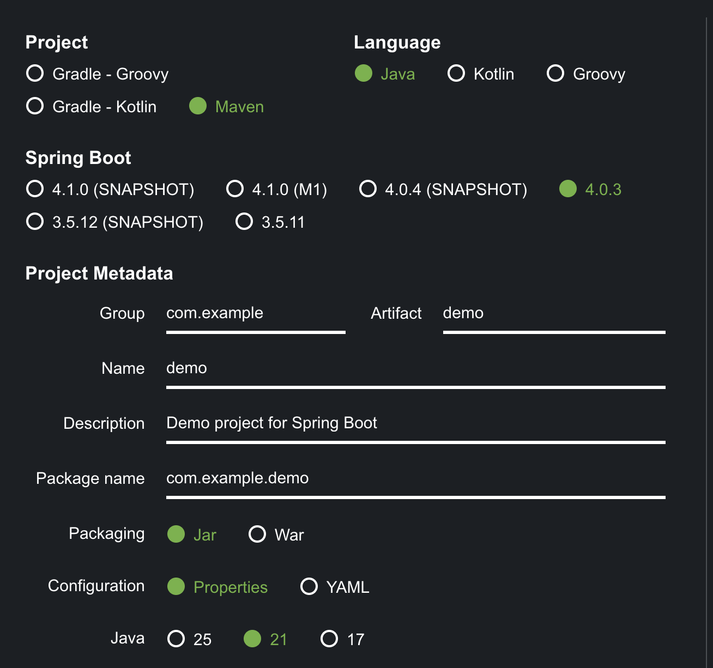
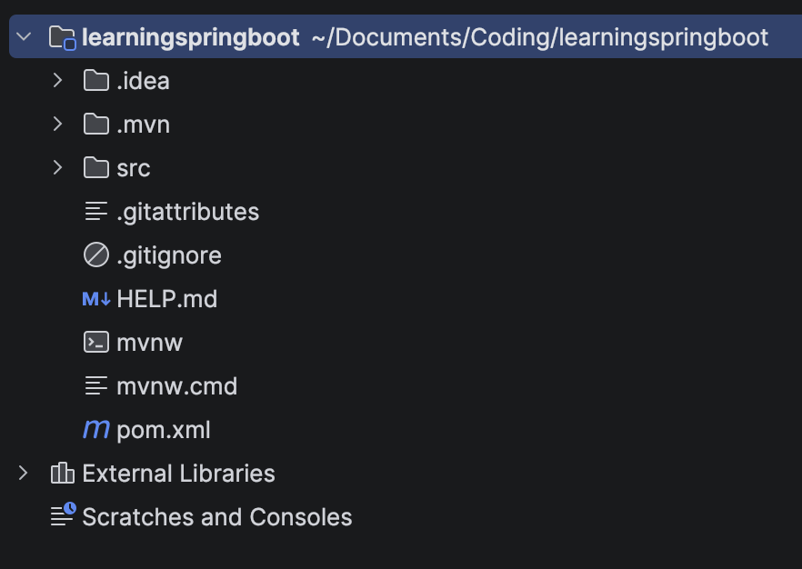

# INTRO

### start.spring.io ?
It’s a website tool called Spring Initializr that helps you quickly create a new Spring Boot project for you.

Instead of manually creating all the folders, files, build config, etc., you just choose a few options and it generates a ready-to-use starter project.



---
### MAVEN ?  
Maven is a tool that manages your project for you.
- Downloads libraries automatically
- Builds (compiles) your project
- Creates a .jar file

You control it using a file called: `pom.xml`

### GRADLE ?
Gradle does the same job as Maven.  
Difference:
- It uses simpler looking code (not XML)
- It is faster, Very common in Android


---
### Spring Boot Version

🟢 4.0.3, Stable latest version.

Avoid: SNAPSHOT (unstable testing version),  
M1 (milestone testing version)

---
### PROJECT METADATA
1. Group: com.example, Like company name.
2. Artifact: Project ID name.
3. Name: Project folder name.
4. Description
5. Package Name: This is your base package, All Java files go inside this.
6. Properties: Keep Properties (simpler), YAML → Same thing, different format.

---
### JAR?

JAR = Java ARchive.  
It is basically a zip file that contains many .class files + other resources.

---
### DEPENDANCIES
- Spring web

---
# <center> FOLDER STRUCTURE


1. `.idea`: IntelliJ settings folder.
2. `.mvn`: Maven wrapper files, Helps run Maven automatically.
3. `pom.xml`: Spring Web is added, Dependencies are managed
4. `mvnw`: Runs Maven on Mac.
5. `src`: 
```
src/main/java
src/main/resources
src/test/java
```
