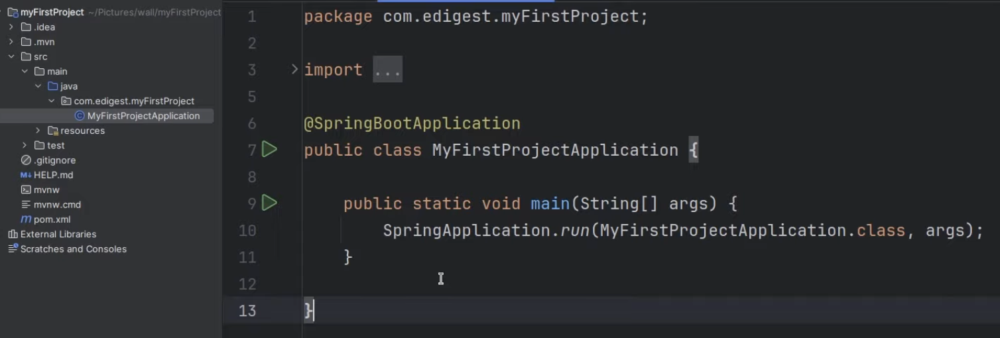

# Why Spring ?

Earlier we used to create objects from class


`Car c = new Car` 

Now we are externalizing object creation, asking spring to do it.  
Spring provides IOC Container which stores all these classes.   

---
### IOC Container ?
Inversion of control. 

**APPLICATION CONTEXT** ?  
It is a way to achieve IOC container 

We have to tell IOC where it has to scan for classes.  
Not every class only with `@annoations`  

---
### ANNOTATIONS
These can be over class, interface, methods, fields which have @something on top, also further called as beans.  

**TYPES** :-
- `@Component` : Tells to put that thing in IOC Container 
- `@SpringBootApplication` : Does work of 3 annotations
    - `@Configuration`
    - `@EnableAutoConfiguration`
    - `@ComponentScan`: Helps IOC contationer to find @Components 
- `@Autowired` : When we are using one class object in other class, if we use new keyword it gonna create 'n' instance, to avoid that  
- `@EnableAutoConfiguration`
- `@RestController` : Same like components + Additional Functionalities

---
# Code Basics 



- `@SpringBootApplication` the entry point of our application, only used with main class.  
- You have to create file under base package.  

---
Suppose we have 2 classes in a single package, one class dependant on other

```java
//Dog.java
package......
import .......

@Component
public class Dog{
    public string fun(){
        return "Something"
    }
}
```
```java
//car.java
package ......
import ....

@RestController
public class Car{

    @Autowired //dependanct injection
    private Dog dog; //Using other class object

    @GetMapping("/ok")
    public string ok(){
        return dog.fun();
    }
}
```