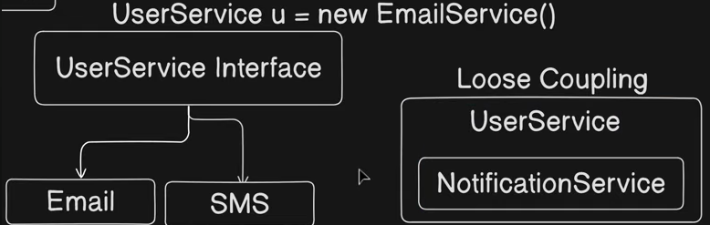

# DESIGN PATTERN ?

TIGHT & LOOSE COUPLING ?  
Tells how two classes are dependant over each other.  
Tight -> More Dependant  
Loose -> Less Dependant

For eg:-

```java
//NotificationService.java
public class NotificationService {
    public void send(String message){
        System.out.println("From notification service : " + message);
    }
}

//UserService.java
public class UserService {
    NotificationService nn = new NotificationService();

    public void notifyUser(String message){
        nn.send(message);
    }
}

//AppMain.java
public class AppMain {
    public static void main(String[] args) 
    {
        UserService uu = new UserService();
        uu.notifyUser("Order placed");
    }
}
```

---
### LOOSE COUPLING -
To implement loose coupling we have to use `interfaces`  

