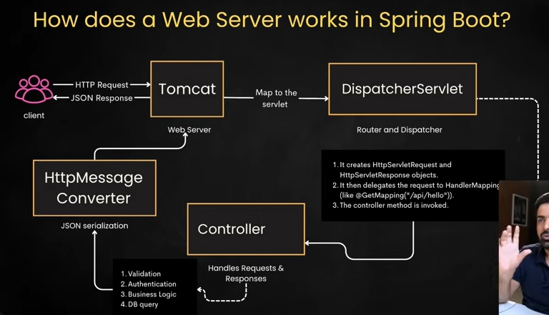

# MVC
To make scalable, independent processes.  

Working ?  
Client request ->  
Controller, checks if valid request and the routes ->  
Handler, communicates & bring data from DB and stores to ->  
Model ->  
View, in a form that user can understand

Spring already has this MVC

---
#### HOW WEB SERVER WORKS IN SPRING ?  

---
Practical :-

Request will go to controller => Use service to create model => Service uses entity and repository => Model will be send back to controller to create further view as json, html or any other format

---
### Three Layered Architecture ?  

Client request -> [ Presentaion Layer ] -> DTA -> [ Service Layer ] -> [ Persistence Layer ]
