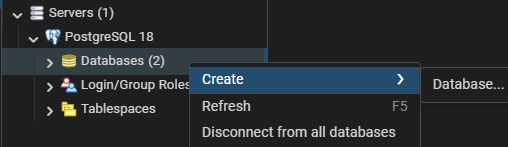
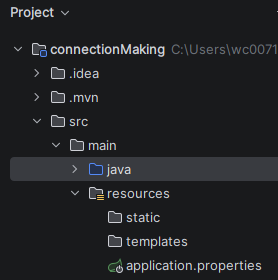
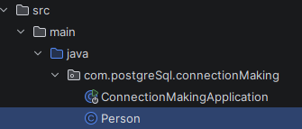
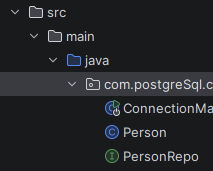

# POSTGRESQL

1. Open pg4admin -> Servers -> postgreSQL -> Databases => Right click and create database, name it, let's say *postgres*

2. Open IntelliJ, Go to src -> main -> resources -> application.properties

3. Add properties

    ```java
    spring.datasources.url=jdbc:postgresql://localhost:5432/databaseName
    spring.datasource.username=postgres //While creating DB
    spring.datasource.password=ayushpoddar  

    spring.jpa.hibernate.ddl-auto=update //shows changes immideatly
    ```

---

### <center>Creating a Table

1. Create a java file in main package, let's say *Person* to be used as table

2. Specify the columns of the table in above class
    ```java
    //Person.java

    @Entity //tells it is an entity
    @Data //for getters, setters
    @Table(name="table_1") //to specify table name, else it'll take class's name by default
    public class Person{
        @Id //to make id as primary key
        @GeneratedValue(strategy=GenerationType.IDENTITY) //autoincrements
        private Long id;

        private String name;
    }
    ```
3. Go to package and create an interface, {Also we call it as repo to connect with DB}, let's say name as PersonRepo  

4. Extend the interface with the class which has table
    ```java
    //PersonRepo.java

    public interface PersonRepo extends JpaRepository <TableName, PrimaryKeyDT>
    ```

Run this code, main file and your table is created!!